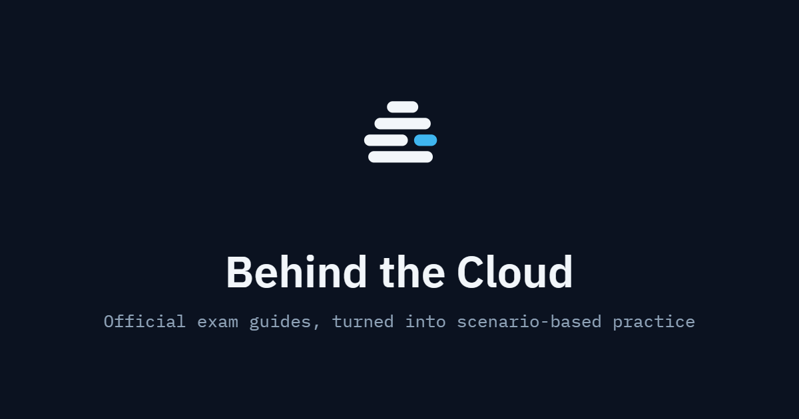

# Behind the Cloud

Official cloud exam guides turned into scenario-based practice questions, instant feedback, and realistic mock exams — one certification track at a time.

## Study Modes

| Mode | Description |
|---|---|
| **Quiz** | Scenario-based questions per exam section with instant answer feedback and score tracking |
| **Flashcards** | 3D flip-card concept review for terms and definitions |
| **Topic Drill** | Deep-dive on specific subtopics within a section |
| **Exam Sim** | Full timed mock exam with section-weighted questions, jump-to-question navigation, and a detailed results breakdown |

## Available Certifications

### Google Cloud — Associate Cloud Engineer (ACE)

Aligned to the June 30, 2025 exam guide.

| Section | Topic | Exam Weight |
|---|---|---|
| §1 | Setting up a cloud solution environment | ~20% |
| §2 | Planning and implementing a cloud solution | ~30% |
| §3 | Deploying and implementing a cloud solution | ~30% |
| §4 | Ensuring successful operation of cloud solution / Access & security | ~20% |

### Coming Soon

- GCP Professional Cloud Architect (PCA)
- GCP Professional Data Engineer (PDE)

## Disclaimer

Question content is AI-generated. Always verify answers against the [official Google Cloud documentation](https://cloud.google.com/docs) and the relevant exam guide.

---

Want to contribute or run this locally? See [CONTRIBUTING.md](CONTRIBUTING.md).
